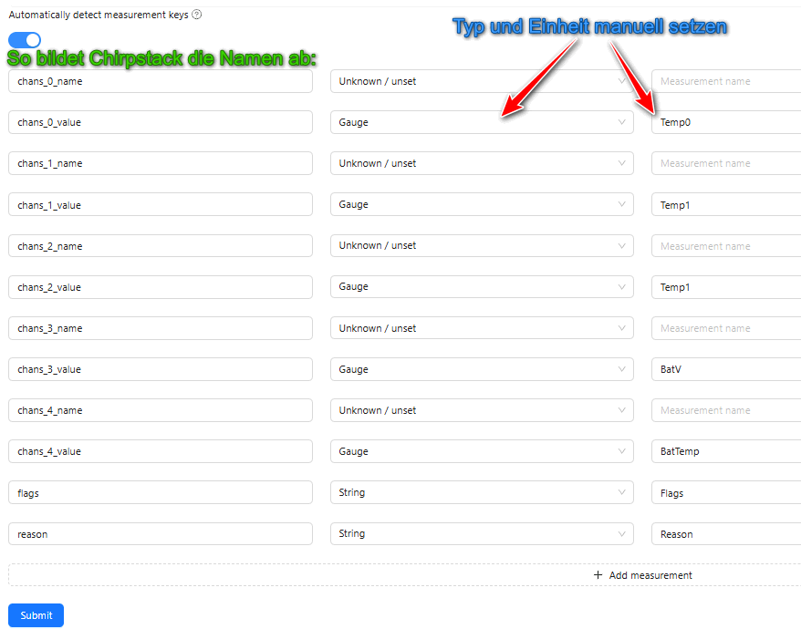

# Chirpstack Payload Decoder Entwicklung

Ein einfacher Payload-Decoder für die LTX-Logger in JavaScript für LoRaWAN (speziell Chirpstack). Dieser Decoder kann direkt in der Chrome-Debugger-Konsole getestet werden.

Chirpstack verwendet QuickJS, um Decoder auszuführen. Die decodierten Daten (`data`) werden als Objekt `object` gespeichert und können z. B. direkt im Portal verwendet werden. Dies ermöglicht eine einfache Visualisierung der Daten im Chirpstack-Portal.

---

## Beispiel für decodierte Daten

```json
{
  "data": {
    "chan_0": {
      "value": 18.15998077392578
    }
  }
}
```

Die Variable `chan_0_value` wird automatisch für Metriken verfügbar gemacht.

---

## QuickJS - Laufzeit-Decoder

QuickJS ist ein leichtgewichtiger JavaScript-Interpreter, der plattformübergreifend funktioniert. Mehr Informationen:

- [QuickJS Website](https://bellard.org/quickjs/)
- [QuickJS GitHub](https://github.com/bellard/quickjs)

### QuickJS auf Windows nutzen

1. Quick-JS-*Cosmo*-Binaries von der [QuickJS Website](https://bellard.org/quickjs/) herunterladen.
2. Entpacken ins Projektverzeichnis und die Datei `qjs` in `qjs.exe` umbenennen.
3. Die anderen Dateien können gelöscht werden.
4. Fertig! Der Interpreter ist einsatzbereit.

### Cosmopolitan

Dank [Cosmopolitan](https://github.com/jart/cosmopolitan) können QuickJS-Binaries auf allen Plattformen ausgeführt werden.

---

## Testen des Decoders

- **Mit Chrome:** Über die Chrome-Debugger-Konsole.
- **Lokal ausführen:** Via Befehl:
  ```bash
  ./qjs paysdi.js
  ```
- **Hinweis:** Den unteren Teil des Scripts (`TESTBEREICH`) entfernen, bevor es im Chirpstack gespeichert wird.

### Fehlerbehandlung

Bei Laufzeitfehlern generiert Chirpstack automatisch einen `ERROR`-Event.

---

## Beispiel

Zum schnellen Testen: `wrk.js`:

```javascript
function decodeUplink(input) {
    let chans = [];
    
    chans.push({ name: "Temp0(°C)", value: 10.3 });
    chans.push({ name: "Temp1(°C)", value: 21.5 });
    chans.push({ name: "Temp2(°C)", value: 12.88 });
    chans.push({ name: "Battery(V)", value: 3.21 });
    chans.push({ name: "Device(°C)", value: -17.22 });
    
    return {
        data: {
            reason: "(MANUAL)",
            flags: "ALARM",
            chans
        }
    };
};
```

Das Ergebnis hängt an den Event an:

```javascript
// ...
"object": {
    "chans": [
        { "value": 10.3, "name": "Temp0(°C)" },
        { "name": "Temp1(°C)", "value": 21.5 },
        { "value": 12.88, "name": "Temp2(°C)" },
        { "name": "Battery(V)", "value": 3.21 },
        { "name": "Device(°C)", "value": -17.22 }
    ],
    "reason": "(MANUAL)",
    "flags": "ALARM"
}, // ...
```

Im Chirpstack wird dies wie folgt erkannt:



---

## Chirpstack Decoder-Template

Hier ist das Standard-Template für Chirpstack:

### Decode Uplink/Downlink Function

```javascript
// Decode uplink function.
//
// Input:
// - bytes: Byte-Array mit dem Uplink-Payload, z. B. [255, 230, 255, 0]
// - fPort: Uplink fPort.
// - variables: Objekt mit den konfigurierten Gerätevariablen.
//
// Output:
// - data: Objekt, das den decodierten Payload repräsentiert.
function decodeUplink(input) {
    return {
        data: {
            temp: 22.5
        }
    };
}

// Encode downlink function.
//
// Input:
// - data: Objekt, das den zu codierenden Payload repräsentiert.
// - variables: Objekt mit den konfigurierten Gerätevariablen.
//
// Output:
// - bytes: Byte-Array mit dem Downlink-Payload.
function encodeDownlink(input) {
    return {
        bytes: [225, 230, 255, 0]
    };
}
```

---
